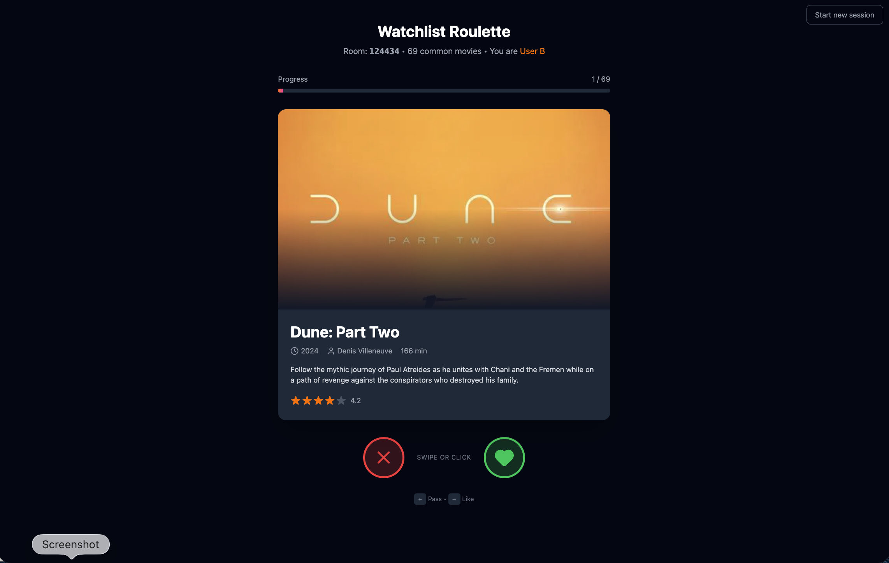

# Letterboxd Replica

A React/Tailwind replica of the Letterboxd watchlist feature, extended with a group movie-matching mode.

---

## The Problem

Deciding what to watch as a couple or group is a frustrating experience — scrolling through individual watchlists, negotiating preferences, and still landing on a film nobody is fully excited about. Letterboxd's existing watchlist is a solo tool with no native way to match overlapping interests between two users.

---

## The Solution

This project replicates Letterboxd's watchlist feature and extends it with a **Roulette mode** — a Tinder-style swipe mechanic that cross-references two watchlists and surfaces movies both users want to watch. State persists locally in the browser with no account or backend required.

---

## Key Features

- Letterboxd-style watchlist grid with hover interactions (add, remove, mark watched, rate)
- **Roulette mode** — swipe mechanic to match movies across two watchlists
- TMDB API integration for real movie search and poster data
- localStorage persistence — no signup, works offline after initial load
- Responsive grid layout with smooth animations

---

## Tech Stack

| Layer | Technologies |
|---|---|
| Frontend | React 19, TypeScript, Vite, Tailwind CSS 4 |
| Icons | lucide-react |
| Data | TMDB API |
| Storage | localStorage |

---

## Getting Started

```bash
# Clone the repository
git clone https://github.com/victorcastillo-pursuit/letterboxd-replica.git
cd letterboxd-replica

# Install dependencies
npm install

# Add your TMDB API key to .env
echo "VITE_TMDB_API_KEY=your_key_here" > .env

# Start development server
npm run dev
```

Open [http://localhost:5173](http://localhost:5173) in your browser.

---

## Screenshots

**Watchlist grid with Start Watchlist Roulette banner**


**Roulette mode — swipe to match movies across two watchlists**



---

## Project Type

Pursuit Fellowship — Solo portfolio project
**Developer:** Victor Castillo
